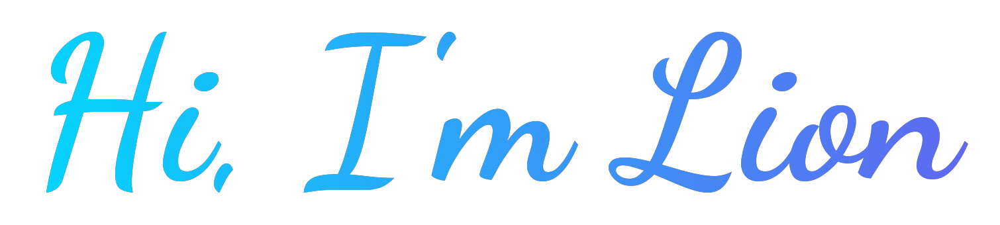

<div align="center">
  
</div>

<div align="center">
  
</div>

<div align="center">
  
</div>

<div align="center">
  <a href="https://git.io/typing-svg"></a>
</div>

<br/>

<div align="center">
  <picture>
    <source media="(prefers-color-scheme: dark)" srcset="https://raw.githubusercontent.com/Lion-1209/Lion-1209/output/github-snake-dark.svg" />
    <source media="(prefers-color-scheme: light)" srcset="https://raw.githubusercontent.com/Lion-1209/Lion-1209/output/github-snake.svg" />
    
  </picture>
</div>

---

## 🚀 About Me

> 技术的最大意义就是普及社会

嵌入式软件工程师，从事过工控、机器人、医疗等行业。Claude Code 高强度使用者，Agent 框架探索者。

```python
class Lion:
    def __init__(self):
        self.name = "Lion"
        self.role = "Embedded Software Engineer"
        self.focus = ["AI Agents", "Claude Code", "Open Source"]
        self.mission = "让技术惠及更多人"
    
    def say_hi(self):
        print("嗨，欢迎来到我的空间！")
```

## 🛠️ 技术栈

<div align="center">

### 嵌入式开发


### 应用与桌面


### AI 工具


</div>

## 📊 GitHub 统计

<div align="center">
  
  
</div>

## 📈 活跃度动图

<div align="center">
  
</div>

## 🔥 连续贡献

<div align="center">
  
</div>

## 🏆 成就

<div align="center">
  
</div>

## 💡 当前探索方向

<div align="center">

| 🤖 Agent 框架 | 🧠 Claude Code | 🏥 医疗设备 | 🌐 技术普及 |
|:---:|:---:|:---:|:---:|
| 探索与实践 | 高效工作流 | 嵌入式开发 | 开源贡献 |

</div>

## 🌐 技术博客 & 社区

<div align="center">
  <a href="https://github.com/Lion-1209?tab=repositories">
    
  </a>
</div>

## 📫 联系我

<div align="center">
  <a href="mailto:702857208@qq.com">
    
  </a>
  <a href="https://github.com/Lion-1209">
    
  </a>
</div>

---

<div align="center">
  
  <br/>
  ⭐️ 从 [Lion-1209](https://github.com/Lion-1209) 开始
</div>

<div align="center">
  
</div>
